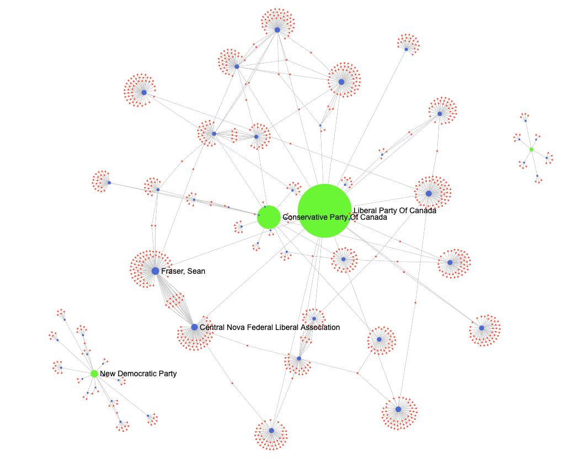

# Lucid Contributions

## Team Members
[Thane Shubaly](https://github.com/shubaly)

## Tool Description
A tool to investigate contributor/recipient networks in political campaign contribution data. 

## Installation
1. Install node: https://docs.npmjs.com/downloading-and-installing-node-js-and-npm

2. Download lucid-contributions:

        git clone git@github.com:shubaly/lucid-contributions.git

3. Move to the tool's directory and install the tool

        cd lucid-contributions
        cd src
        npm install
        npm start

## Usage
- Download campaign contribution datasets, e.g. https://www.elections.ca/content.aspx?section=fin&dir=oda&document=index&lang=e
  - Copy data to ./public/data.csv
  - Required fields: `Recipient,Political Party of Recipient,Contributor name,Monetary amount`
- Sample visualizaton:

### Additional Information
- Next Steps
  - Fix packaging/installation
  - Make this work with any jurisdiction's data without code changes!

- Enhancements
  - Make nodes draggable so researchers can reposition
  - Size nodes based on contribution value (+ sum for recipients)
  - Add ability to search for contributor / recipient 

- Built with [Sigma.js](https://www.sigmajs.org/)
